# USER_FLOWS.md — The Story Portal

**Version**: 1.0  
**Last Updated**: December 21, 2024  
**Status**: Living Document  
**Companion to**: APP_SPECIFICATION.md

---

## Table of Contents

1. [Flow Philosophy](#1-flow-philosophy)
2. [Core Story Loop](#2-core-story-loop)
3. [First-Time User Onboarding](#3-first-time-user-onboarding)
4. [Recording Flows](#4-recording-flows)
5. [New Topics Flow](#5-new-topics-flow)
6. [My Stories Gallery](#6-my-stories-gallery)
7. [Navigation State Diagram](#7-navigation-state-diagram)
8. [Permissions vs. Consent](#8-permissions-vs-consent)
9. [Error States & Recovery](#9-error-states--recovery)

---

## 1. Flow Philosophy

### The Wheel Is the Product

Recording is optional. The core ritual is:

```
Spin → Contemplate → Tell story aloud → Pass app to next person
```

Most stories will never be recorded. They exist in the moment, witnessed by those present. This is intentional—it honors the "analog soul" principle from the spec.

Recording is *capture*, not the experience itself.

### Three Primary Flows

| Flow | Frequency | Data Captured |
|------|-----------|---------------|
| **Spin Only** | Most common | GA4: `wheel_spin` |
| **Self Recording** | Occasional | GA4: `wheel_spin`, `recording_start`, `recording_complete`, `story_saved` |
| **Recording Others** | Connector persona | Same as above + consent metadata |

### Persona Considerations

All flows assume a **group session context**. The app is passed between participants.

| Persona | Primary Concern | Flow Accommodations |
|---------|-----------------|---------------------|
| **The Connector** | Facilitate deeper conversations, capture others' stories | Clear consent flow, email capture for follow-up |
| **The Reluctant Storyteller** | Fear of not having "good" stories, fear of messing up | One-pass safety valve, re-record keeps previous take, facilitation hints normalize imperfection |
| **The Facilitator** | Keep group energy, structured activity | Fast spin-to-story flow (~30s), clear visual states |
| **The Declarer** | Tendency to state rather than narrate | Facilitation hints guide toward story, declaration-risk prompts flagged |

---

## 2. Core Story Loop

### State Diagram

```mermaid
stateDiagram-v2
    [*] --> Idle: App Ready
    
    %% ==========================================
    %% WHEEL PHASE
    %% ==========================================
    
    state "🎡 Wheel Phase" as WheelPhase {
        Idle --> Spinning: Tap/Swipe
        Spinning --> Landing: Momentum depleted
        Landing --> PromptRevealed: Snap to prompt
    }
    
    %% ==========================================
    %% PROMPT PHASE  
    %% ==========================================
    
    state "📜 Prompt Phase" as PromptPhase {
        PromptRevealed --> PassDecision: User considers prompt
        
        state PassDecision <<choice>>
        PassDecision --> Spinning: Tap Pass (1st spin only)
        PassDecision --> Contemplation: Proceed (implicit accept)
        
        state Contemplation {
            [*] --> DisplayPrompt
            DisplayPrompt --> DisplayHint: 4-5s (if declaration_risk)
            DisplayHint --> DisplayPrompt: 4-5s cycle
        }
    }
    
    %% ==========================================
    %% STORY PHASE (Branching Paths)
    %% ==========================================
    
    state "🗣️ Story Phase" as StoryPhase {
        Contemplation --> TellStory: Tell without recording
        Contemplation --> WhoseStory: Tap Record
        
        TellStory --> Idle: Pass app to next person
        
        state WhoseStory <<choice>>
        WhoseStory --> SelfConsent: "My Story"
        WhoseStory --> OtherConsentFlow: "Someone Else's"
        
        SelfConsent --> Recording: Quick affirm
        
        state OtherConsentFlow {
            [*] --> ShowConsentScript
            ShowConsentScript --> AwaitTap: Storyteller reads script
            AwaitTap --> CaptureEmail: Tap "I Consent"
            CaptureEmail --> ReadyToRecord: Email entered or skipped
        }
        OtherConsentFlow --> Recording: Begin recording
    }
    
    %% ==========================================
    %% RECORDING PHASE
    %% ==========================================
    
    state "🎙️ Recording Phase" as RecordingPhase {
        state Recording {
            [*] --> VerbalConsent: Other's story
            [*] --> Active: Self story
            VerbalConsent --> Active: Consent stated into mic
            Active --> Paused: Tap Pause
            Paused --> Active: Tap Resume
            Active --> TimeWarning: 4:30 elapsed
            TimeWarning --> Stopped: 5:00 reached (auto-stop)
            Active --> Stopped: Tap Stop
            TimeWarning --> Stopped: Tap Stop
        }
    }
    
    %% ==========================================
    %% SAVE PHASE
    %% ==========================================
    
    state "💾 Save Phase" as SavePhase {
        Recording --> Review: Recording complete
        
        state Review {
            [*] --> PlaybackControls
            PlaybackControls --> ConfirmSave: "Keep"
            PlaybackControls --> ReRecord: "Re-record"
        }
        
        ReRecord --> Recording: Previous take preserved until new save
        
        ConfirmSave --> PhotoPrompt
        
        state PhotoPrompt <<choice>>
        PhotoPrompt --> AttachPhoto: "Add Photo"
        PhotoPrompt --> Saving: "Skip"
        
        AttachPhoto --> Saving: Photo attached
        
        state Saving {
            [*] --> WritingToStorage
            WritingToStorage --> SaveSuccess: IndexedDB OK
            WritingToStorage --> SaveFailed: Write error
            SaveFailed --> WritingToStorage: Tap Retry
            SaveFailed --> HoldInMemory: Tap Try Later
            HoldInMemory --> Idle: Story held until retry or app close
        }
        
        SaveSuccess --> StorySaved
    }
    
    StorySaved --> Idle: Ready for next person
```

### State Descriptions

#### Wheel Phase

| State | UI Elements | Entry | Exit | Analytics |
|-------|-------------|-------|------|-----------|
| **Idle** | Wheel visible, "Spin the wheel" prompt | App launch, return from StorySaved | User initiates spin | — |
| **Spinning** | Wheel rotating, momentum-based physics | Tap/swipe on wheel | Momentum below threshold | `wheel_spin` |
| **Landing** | Deceleration animation | Physics calculation | Wheel stops | — |
| **PromptRevealed** | Prompt visible, flame animation begins, Pass button visible (1st spin only) | Wheel stopped | User decision | — |

#### Prompt Phase

| State | UI Elements | Entry | Exit | Analytics |
|-------|-------------|-------|------|-----------|
| **Contemplation** | Prompt prominent, flame animation, Record button visible, facilitation hints cycling | Accept pressed OR 2nd spin landed | User tells story OR taps Record | `prompt_pass` (if passed on 1st spin) |

**Contemplation UI Detail:**
- Prompt displayed prominently with flame animation around panel
- Record button visible but not emphasized (recording is optional)
- Facilitation hints cycle with the following logic:

**Hint Cycling Logic (Option C):**
```
If declaration_risk prompt:
  1. Show facilitation_hint FIRST (6-8 seconds)
  2. Then cycle base cues (4-5 seconds each):
     - "Take a breath. There's no rush."
     - "What moment comes to mind?"
     - "Trust the first memory that surfaces."
  3. Loop back to facilitation_hint
  
If NOT declaration_risk prompt:
  - Cycle base cues only (4-5 seconds each)
```

The prompt-specific hint leads because it's the most important coaching for avoiding declarations.

#### Story Phase

| State | UI Elements | Entry | Exit | Analytics |
|-------|-------------|-------|------|-----------|
| **TellStory** | Prompt remains visible, no recording UI | User begins speaking (no tap needed) | User passes app | — |
| **WhoseStory** | Modal: "My Story" / "Someone Else's Story" | Tap Record | Selection made | — |
| **SelfConsent** | Brief confirmation | "My Story" selected | Affirm | — |
| **OtherConsentFlow** | Consent script, "I Consent" button, email field | "Someone Else's" selected | Email captured/skipped | — |

#### Recording Phase

| State | UI Elements | Entry | Exit | Analytics |
|-------|-------------|-------|------|-----------|
| **VerbalConsent** | Prompt to state consent, mic active | Recording others | Consent stated | — |
| **Active** | Waveform, timer, Pause/Stop buttons | Recording started | Pause or Stop | `recording_start` |
| **Paused** | "Paused" indicator, Resume/Stop buttons | Tap Pause | Resume or Stop | — |
| **TimeWarning** | Visual pulse, "30 seconds remaining" | 4:30 elapsed | Stop or auto-stop | — |
| **Stopped** | Recording complete indicator | Tap Stop OR 5:00 reached | Transition to Review | `recording_complete` |

#### Save Phase

| State | UI Elements | Entry | Exit | Analytics |
|-------|-------------|-------|------|-----------|
| **Review** | Playback controls, "Keep" / "Re-record" buttons | Recording stopped | User decision | — |
| **ReRecord** | Returns to Recording | "Re-record" tapped | New recording started | — |
| **PhotoPrompt** | Camera/gallery option, "Skip" button | "Keep" tapped | Photo added or skipped | — |
| **Saving** | Progress indicator | Photo step complete | Save success or failure | — |
| **SaveSuccess** | Confirmation, brief celebration | IndexedDB write OK | Auto-transition | `story_saved` |
| **SaveFailed** | Error message, "Retry" / "Try Later" buttons | Write error | User decision | — |
| **StorySaved** | "Story saved" confirmation | Save complete | Transition to Idle | — |

### Pass Rule

```
First spin:  Pass button visible → Tap to re-spin
Second spin: No Pass button → Must proceed with prompt
```

**UI Note:** There is no "Accept" button. Acceptance is implicit—the user proceeds by tapping Record or simply telling their story aloud. Pass is the only explicit action, and it's only available on the first spin.

**Note:** Re-spin may land on the same prompt. This is by design—low probability, and acceptance is part of the ritual.

### Re-record Behavior

When user taps "Re-record":
1. Previous take is **preserved** in memory
2. New recording begins
3. Previous take is **deleted only when new take is saved**
4. If user abandons mid-re-record, previous take can be recovered

This protects the Reluctant Storyteller from accidental loss.

---

## 3. First-Time User Onboarding

### Goal

**Spin within 30 seconds.** Show, don't lecture.

### Flow


### Onboarding Principles

| Principle | Implementation |
|-----------|----------------|
| **Show, don't tell** | Wheel is the first thing they see and interact with |
| **Minimal text** | One instruction at a time, max 5 words |
| **No blocking modals** | Onboarding overlays the main UI, doesn't replace it |
| **Forgiveness** | Skip available at every step |
| **Progressive disclosure** | Recording, settings, etc. discovered organically |

### First-Time User Screens

| Screen | Duration | Content | Skip? |
|--------|----------|---------|-------|
| **Splash** | 2s or tap | Logo, tagline | Tap anywhere |
| **Wheel Intro** | Until spin | Wheel visible, "Tap to spin" overlay | Yes |
| **Post-First-Spin** | N/A | Normal Contemplation state | N/A |

**What we DON'T show on first launch:**
- Feature tours
- Permission requests (deferred until needed)
- Account creation prompts
- Settings explanation

### Deferred Discovery

| Feature | Discovered When |
|---------|-----------------|
| Recording | User notices Record button during Contemplation |
| My Stories | User saves first story, sees gallery hint |
| Topic Packs | User notices "New Topics" after several spins |
| How to Play | User taps menu, explores |

---

## 4. Recording Flows

### 4.1 Self Recording Flow

The simpler path—user is recording their own story.


**Self Consent UI:**
- Single screen: "Ready to tell your story?"
- "Start Recording" button
- No email capture needed
- No verbal consent prompt (implicit in the act of recording yourself)

### 4.2 Recording Others Flow (Connector Persona)

The Connector is capturing someone else's story. Full consent flow required.


**Consent Script (displayed on screen, read by storyteller into recording):**

> "I consent to having my story recorded by The Story Portal."

**Email Capture:**
- Purpose: Enable approval/download flow (Phase 2)
- Optional: Can be skipped
- Stored: With story metadata, not in audio

**What gets stored:**

```typescript
interface ConsentMetadata {
  type: 'self' | 'other';
  tapConsentTimestamp: string;      // When they tapped "I Consent"
  verbalConsentInAudio: boolean;    // Always true for 'other'
  email?: string;                   // Optional, for follow-up
  storytellerName?: string;         // Optional, entered by Connector
}
```

---

## 5. New Topics Flow

### Purpose

Switch between prompt packs (e.g., "Default" → "Love Burn 2025").

### Friction Mechanism

Per spec Section 3: "New Topics requires friction mechanism."

**Rationale:** Prevents prompt shopping. The wheel should feel like fate, not a menu.

### Flow


### Topic Pack Data

From `prompts.json`:

```json
{
  "packs": [
    {
      "id": "default",
      "name": "Default",
      "description": "Curated general-audience prompts",
      "is_default": true
    },
    {
      "id": "love-burn-2025",
      "name": "Love Burn 2025",
      "description": "Event-specific prompts for Love Burn festival",
      "is_default": false
    }
  ]
}
```

### Constraints

| Rule | Reason |
|------|--------|
| Cannot switch while spinning | Prevents gaming the system |
| Confirmation required | Prevents accidental switch |
| **Spin count resets on switch** | **New pack = fresh start. User gets one new pass.** |
| No preview of prompts | Preserves spontaneity |

**Pack Change Pass Reset (Confirmed):**
Switching topic packs resets the spin count to zero. This means:
- User can pass on their first spin with the new pack
- Second spin with new pack must be accepted
- Rationale: Each pack is a distinct experience; resetting honors the "fresh start"

### Analytics

| Event | Trigger |
|-------|---------|
| `topic_pack_changed` | Pack successfully switched |

---

## 6. My Stories Gallery

### Purpose

View, playback, and manage saved stories.

### Flow


### Story Card Display

| Element | Source |
|---------|--------|
| Prompt text | `story.prompt.text` |
| Duration | `story.duration` (formatted as M:SS) |
| Date | `story.timestamp` (relative: "2 days ago") |
| Photo thumbnail | `story.photo` (if attached) |
| Storyteller | `story.storytellerName` or "My Story" |

### Story Detail View

| Element | Description |
|---------|-------------|
| **Prompt** | Full text, styled prominently |
| **Photo** | Full-size if attached |
| **Audio player** | Play/pause, scrubber, duration |
| **Metadata** | Date, duration, storyteller name |
| **Actions** | Delete, Share (Phase 2) |

### Deletion Flow

```
Tap Delete → "Delete this story forever?" → Confirm → Story removed from IndexedDB
```

**No undo.** Deletion is permanent. Confirmation modal is required.

### Sharing (Phase 2)

| Feature | Status |
|---------|--------|
| Share via link | Phase 2 |
| Share via QR code | Phase 2 |
| Download audio | Phase 2 |
| Email to storyteller | Phase 2 (requires captured email) |

---

## 7. Navigation State Diagram

### All Screens

```mermaid
stateDiagram-v2
    [*] --> Splash: App launch (first time)
    [*] --> Wheel: App launch (returning)
    
    Splash --> Wheel: Onboarding complete
    
    state "Main Experience" as Main {
        Wheel --> Contemplation: Spin complete
        Contemplation --> Recording: Tap Record
        Recording --> Review: Stop recording
        Review --> Wheel: Save complete
        Contemplation --> Wheel: Story told (no recording)
    }
    
    state "NavButtons (Always Visible)" as NavButtons {
        Wheel --> MyStories: NavButton → My Stories
        Wheel --> HowToPlay: NavButton → How to Play
        
        MyStories --> Wheel: Back
        HowToPlay --> Wheel: Back
    }
    
    state "Menu (Hamburger)" as Menu {
        Wheel --> OurStory: Menu → Our Story
        Wheel --> OurWork: Menu → Our Work
        Wheel --> Privacy: Menu → Privacy Policy
        Wheel --> Booking: Menu → Book Us
        
        OurStory --> Wheel: Back
        OurWork --> Wheel: Back
        Privacy --> Wheel: Back
        Booking --> Wheel: Back
    }
    
    MyStories --> StoryDetail: Tap story
    StoryDetail --> MyStories: Back
```



### Screen Inventory

| Screen | Type | Access | MVP? |
|--------|------|--------|------|
| **Splash** | Onboarding | First launch only | ✅ |
| **Wheel** | Core | Home/default | ✅ |
| **Contemplation** | Core | After spin | ✅ |
| **Recording** | Core | After consent | ✅ |
| **Review** | Core | After recording | ✅ |
| **My Stories** | Gallery | NavButton (always visible) | ✅ |
| **Story Detail** | Gallery | Tap story | ✅ |
| **How to Play** | Content | NavButton (always visible) | ✅ |
| **Our Story** | Content | Menu | ✅ |
| **Our Work** | Content | Menu | ✅ |
| **Privacy Policy** | Content | Menu | ✅ |
| **Book Us** | Content | Menu | ✅ |
| **Topic Picker** | Modal | "New Topics" button | ✅ |

### Navigation Patterns

| Pattern | Behavior |
|---------|----------|
| **Back from content** | Returns to Wheel |
| **Back from gallery** | Returns to Wheel |
| **Back from story detail** | Returns to gallery |
| **Back during recording** | Confirm discard modal |
| **Android back button** | Follows same patterns |
| **Swipe gestures** | Not implemented in MVP |

---

## 8. Permissions vs. Consent

### Two Distinct Concepts

| Type | What It Is | When Requested | Stored Where |
|------|------------|----------------|--------------|
| **Technical Permissions** | OS-level access to device capabilities | On first use of feature | Browser/OS |
| **Story Consent** | Agreement to have story recorded | Every time recording others | With story metadata |

### Technical Permissions

| Permission | Trigger | Fallback |
|------------|---------|----------|
| **Microphone** | First tap on Record | Show error, link to settings |
| **Camera** | First tap on "Add Photo" (camera option) | Offer gallery-only option |
| **Storage** | Automatic (IndexedDB doesn't require permission) | N/A |

### Permission Request Flow


### Story Consent (Recording Others)

| Step | Actor | Purpose |
|------|-------|---------|
| 1. Tap consent | Storyteller | Written acknowledgment |
| 2. Email (optional) | Storyteller | Future approval/download |
| 3. Verbal consent | Storyteller | Captured in audio |

**Consent is captured, not just acknowledged.** The verbal consent in the audio file serves as the primary record.

### Consent Data Model

```typescript
interface StoryRecord {
  id: string;
  audioBlob: Blob;
  prompt: Prompt;
  timestamp: string;
  duration: number;
  photo?: Blob;
  
  // Consent data
  consent: {
    type: 'self' | 'other';
    tapTimestamp?: string;
    verbalConsentInAudio: boolean;
    storytellerEmail?: string;
    storytellerName?: string;
  };
}
```

---

## 9. Error States & Recovery

### Error Categories

| Category | Examples | Severity |
|----------|----------|----------|
| **Permission** | Mic denied, camera denied | Blocking |
| **Storage** | IndexedDB full, write failed | Blocking (for save) |
| **Recording** | Interrupted, browser tab hidden | Recoverable |
| **Network** | Offline during sync (Phase 2) | Deferred |

### 9.1 Microphone Permission Denied


**Error Message:**

> **Microphone Access Needed**
> 
> To record your story, please allow microphone access in your browser settings.
> 
> [Open Settings] [Not Now]

### 9.2 Storage Full


**Error Message:**

> **Storage Full**
> 
> Your device is out of space. Delete some saved stories to make room.
> 
> [Manage Stories] [Try Later]

**Note:** "Try Later" keeps the story in memory. If user closes app, unsaved story is lost.

### 9.3 Recording Interrupted

Triggers:
- Phone call received
- Browser tab hidden/switched
- Screen locked
- App backgrounded


**Error Message:**

> **Recording Interrupted**
> 
> The recording stopped when you left the app. Would you like to start over?
> 
> [Start Over] [Cancel]

### 9.4 Save Failure & Retry (MVP)

For MVP, save failures are handled simply: show error, offer manual retry.


**Error Message:**

> **Couldn't Save Story**
> 
> Something went wrong. Your story is still here—try saving again.
> 
> [Retry] [Try Later]

**Behavior:**
- **Retry:** Attempts IndexedDB write again
- **Try Later:** Returns to Idle, story remains in memory
- **Warning:** If user closes app with unsaved story, it will be lost

**Phase 2 Enhancement:** Automatic background retry queue with persistence.

### 9.5 Offline Behavior

| Feature | Offline Behavior |
|---------|------------------|
| Wheel spin | Works (prompts cached) |
| Recording | Works (saved locally) |
| Save | Works (IndexedDB) |
| My Stories | Works (local data) |
| Content screens | Works (cached in service worker) |
| Cloud sync | Deferred until online (Phase 2) |

---

## Appendix: Analytics Events Reference

From APP_SPECIFICATION.md Section 7:

| Event | Trigger | Properties |
|-------|---------|------------|
| `wheel_spin` | Spin initiated | — |
| `prompt_pass` | Pass button tapped | `prompt_id` |
| `recording_start` | Recording begins | `prompt_id`, `consent_type` |
| `recording_complete` | Recording stops | `duration`, `prompt_id` |
| `story_saved` | Save successful | `prompt_id`, `has_photo`, `consent_type` |
| `topic_pack_changed` | Pack switched | `from_pack`, `to_pack` |

---

*This is a living document. Update as implementation reveals edge cases.*
